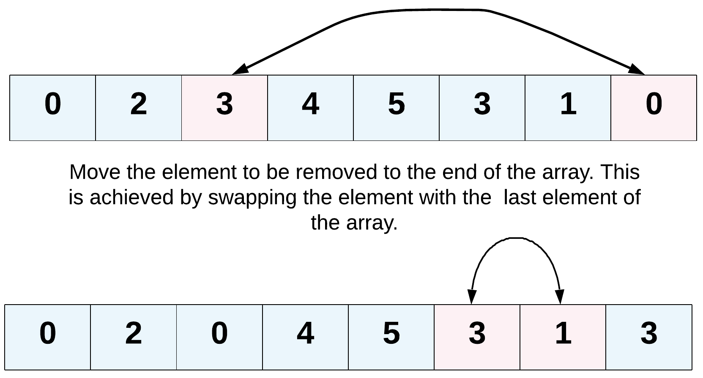

## Remove Element

Given an integer array `nums` and an integer `val`, remove all occurrences of `val` in `nums` [**in-place**](https://en.wikipedia.org/wiki/In-place_algorithm). The order of the elements may be changed. Then return _the number of elements in_ `nums` _which are not equal to_ `val`.

Consider the number of elements in `nums` which are not equal to `val` be `k`, to get accepted, you need to do the following things:

- Change the array `nums` such that the first `k` elements of `nums` contain the elements which are not equal to `val`. The remaining elements of `nums` are not important as well as the size of `nums`.
- Return `k`.

#### Custom Judge:

The judge will test your solution with the following code:

```
int[] nums = [...]; // Input array
int val = ...; // Value to remove
int[] expectedNums = [...]; // The expected answer with correct length.
// It is sorted with no values equaling val.

int k = removeElement(nums, val); // Calls your implementation

assert k == expectedNums.length;
sort(nums, 0, k); // Sort the first k elements of nums
for (int i = 0; i < actualLength; i++) {
    assert nums[i] == expectedNums[i];
}
```

If all assertions pass, then your solution will be **accepted**.

#### Example 1:

```
Input: nums = [3,2,2,3], val = 3
Output: 2, nums = [2,2,_,_]
Explanation: Your function should return k = 2, with the first two elements of nums being 2.
It does not matter what you leave beyond the returned k (hence they are underscores).
```

#### Example 2:

```
Input: nums = [0,1,2,2,3,0,4,2], val = 2
Output: 5, nums = [0,1,4,0,3,_,_,_]
Explanation: Your function should return k = 5, with the first five elements of nums containing 0, 0, 1, 3, and 4.
Note that the five elements can be returned in any order.
It does not matter what you leave beyond the returned k (hence they are underscores).
```

#### Constraints:

- `0 <= nums.length <= 100`
- `0 <= nums[i] <= 50`
- `0 <= val <= 100`

#### Hint:

1. The problem statement clearly asks us to modify the array in-place and it also says that the element beyond the new length of the array can be anything. Given an element, we need to remove all the occurrences of it from the array. We don't technically need to **remove** that element per-say, right?
2. We can move all the occurrences of this element to the end of the array. Use two pointers!
   
3. Yet another direction of thought is to consider the elements to be removed as non-existent. In a single pass, if we keep copying the visible elements in-place, that should also solve this problem for us.

## Solution

### Overview:

The "Remove Element" problem involves manipulating an array in-place to remove all occurrences of a specific value while preserving the order of other elements. The goal is to return the count of elements remaining after the removal operation. This problem tests your understanding of array manipulation, in-place algorithms, and pointer manipulation.

#### Approaches:

1. **Using Two Pointers:**

   - Initialize a pointer `k` to keep track of the position where non-'val' elements should be placed.
   - Iterate through the array with a pointer `i`.
   - If `nums[i]` is not equal to `val`, copy the value to `nums[k]` and increment `k`.
   - Finally, return `k` as it represents the number of non-'val' elements.

2. **Using Array Filter:**

   - Use the `filter` method on the array to create a new array containing only non-'val' elements.
   - Replace the original array with the filtered array.
   - Return the length of the new array as the answer.

3. **Using Array Reduce:**

   - Use the `reduce` method on the array to build a new array that excludes 'val' elements.
   - Return the length of the new array as the answer.

4. **Using Array Splice:**
   - Iterate through the array in reverse order to safely remove 'val' elements using the `splice` method.
   - Return the length of the modified array as the answer.

#### Notes:

- The problem emphasizes in-place manipulation, meaning that modifying the array itself is required, and the positions beyond the new length of the array can contain any values.
- The order of non-'val' elements must be preserved, but the order of 'val' elements doesn't matter.
- The provided "Custom Judge" code ensures that the solution is correct by comparing the modified array with the expected answer and checking whether the first `k` elements of the array are correct.

#### Key Takeaways:

- This problem demonstrates various ways to modify an array in-place by removing specific elements.
- It's important to understand the trade-offs between different approaches in terms of time complexity and space complexity.
- Practice with this problem can improve your skills in working with array manipulation and in-place algorithms.

### Approach 1: Using Two Pointers

1.  Initialize a variable `k` to 0 to keep track of the position to insert non-'val' elements.
2.  Iterate through the array using a pointer `i`.
    - If the element at index `i` is not equal to `val`, copy it to the position `k` in the array and increment `k`.
3.  Return the value of `k` as the count of non-'val' elements.

#### Implementation:

```javascript
function removeElement(nums, val) {
  let k = 0; // Initialize a pointer to keep track of the current position to insert non-'val' elements

  for (let i = 0; i < nums.length; i++) {
    if (nums[i] !== val) {
      nums[k] = nums[i]; // Copy non-'val' elements to the front of the array
      k++;
    }
  }

  return k;
}
```

#### Complexity Analysis:

- **Time Complexity: O(n)**
  - The algorithm involves a single pass through the array of length `n`.
  - Each element is visited once, and the copying of non-'val' elements to the front of the array takes constant time.
- **Space Complexity: O(1)**
  - The algorithm is performed in-place, so no additional space is used except for a few constant extra variables (`k`, `i`).

#### Pros:

- **Efficiency:** This approach has linear time complexity and constant space complexity, making it efficient for large arrays.
- **In-Place Modification:** It modifies the array in-place, which can be important in scenarios with memory constraints.
- **Preserves Order:** The order of non-'val' elements is preserved, which can be crucial if element order matters.

#### Cons:

- **Potential for Unordered Elements:** The order of 'val' elements is not preserved, which might be a disadvantage in some scenarios.
- **Not Suitable for Unsorted Arrays:** This approach assumes element order is maintained, which may not be suitable for unsorted arrays.

#### Real-Life Usage:

- This approach is suitable when working with ordered data where you need to efficiently remove specific elements and preserve the order of other elements, such as filtering logs or processing time-series data.

### Approach 2: Using Array Filter

1.  Use the `filter` method on the array to create a new array containing only elements not equal to `val`.
2.  Replace the original array with the new filtered array.
3.  Return the length of the new array as the answer.

#### Implementation:

```javascript
function removeElement(nums, val) {
  nums = nums.filter((num) => num !== val); // Use the filter method to remove 'val' elements
  return nums.length;
}
```

#### Complexity Analysis:

- **Time Complexity: O(n)**
  - The `filter` method iterates through the array once, checking each element for equality with 'val'.
- **Space Complexity: O(n)**
  - The `filter` method creates a new array containing only non-'val' elements.
  - The space occupied by the new array depends on the number of non-'val' elements, which could be up to `n`.

#### Pros:

- **Readability:** This approach is concise and easy to understand due to the use of the built-in `filter` method.

#### Cons:

- **Additional Space:** It creates a new array, which consumes additional memory.
- **Suboptimal Time Complexity:** It has linear time complexity, which is fine for small arrays but can be inefficient for large arrays.

#### Real-Life Usage:

- It's handy for scenarios where code readability is prioritized over memory usage, such as scripting or quick data manipulations.

### Approach 3: Using Array Reduce

1.  Use the `reduce` method on the array to build a new array.
2.  For each element in the original array, if it's not equal to `val`, append it to the new array being built.
3.  Return the length of the new array as the answer.

#### Implementation:

```javascript
function removeElement(nums, val) {
  nums = nums.reduce((acc, num) => {
    if (num !== val) {
      acc.push(num); // Build a new array with non-'val' elements
    }
    return acc;
  }, []);

  return nums.length;
}
```

#### Complexity Analysis:

- **Time Complexity: O(n)**
  - The `reduce` method iterates through the array once, building a new array with non-'val' elements.
- **Space Complexity: O(n)**
  - Similar to the `filter` approach, the `reduce` approach also creates a new array to store non-'val' elements.

#### Pros:

- **Functional Approach:** It demonstrates the use of the `reduce` method for array manipulation.
- **Readability:** The code is clear and concise.

#### Cons:

- **Additional Space:** Like Approach 2, it creates a new array, incurring additional memory overhead.
- **Suboptimal Time Complexity:** Similar to Approach 2, the time complexity is linear and might be inefficient for large arrays.

#### Real-Life Usage:

- This approach is educational, useful for learning functional programming concepts, but might not be the most efficient choice for practical use due to additional memory consumption.

### Approach 4: Using Array Splice

1.  Iterate through the array in reverse order (from last element to first).
    - If the element at index `i` is equal to `val`, use the `splice` method to remove it from the array.
2.  Return the length of the modified array as the answer.

#### Implementation:

```javascript
function removeElement(nums, val) {
  for (let i = nums.length - 1; i >= 0; i--) {
    if (nums[i] === val) {
      nums.splice(i, 1); // Remove 'val' elements using splice
    }
  }

  return nums.length;
}
```

#### Complexity Analysis:

- **Time Complexity: O(n^2)**
  - In the worst case, each `splice` operation takes O(n) time, and it is performed up to `n` times (if all elements are 'val').
- **Space Complexity: O(1)**
  - The algorithm is performed in-place, so no additional space is used except for a few constant extra variables (`i`).

#### Pros:

- **In-Place Modification:** Modifies the array in-place, which can be useful in memory-constrained situations.

#### Cons:

- **Quadratic Time Complexity:** The `splice` operation can lead to quadratic time complexity in the worst case.
- **Less Efficient:** Due to its inefficiency, it might not be suitable for larger arrays.

#### Real-Life Usage:

- Situations where the removal of a few specific elements is required and time complexity is not a major concern.

#### Notes:

- Approach 1 is the most efficient among these approaches as it has linear time complexity and constant space complexity.
- Approach 2 and Approach 3 have the same time complexity but use additional space for creating new arrays.
- Approach 4 is less efficient due to the potential quadratic time complexity introduced by the `splice` operation.

Overall, Approach 1 using two pointers is the recommended solution due to its optimal time and space complexity. It performs the required operations in a single pass through the array while using constant extra space. The other approaches are provided for illustrative purposes, but they are less efficient in terms of either time complexity or space complexity.
